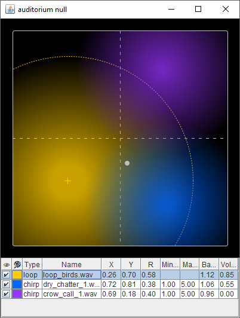

# auditorium

Soundscape playback tool for playing ambient audio for immersion, focus, tabletop games, or live performance

A proof of concept more than anything else, inspired by [tat](https://www.paradiso.zone/ooo-tat/)



## Download

Pre-built JARs available in GitHub [releases](https://github.com/michalwa/auditorium/releases)

## Usage

Run with `java -jar auditorium-*-jar-with-dependencies.jar`

On Windows you can create a shortcut with the above command (substitute `*` for your version) and set it to open the console minimized.

Manual:
- Right-click in the 2D area to add a _loop_ or a _chirp_.
  - A _loop_ play a single audio file on repeat.
  - A _chirp_ plays a random audio file from a selection of one or more audio files at random intervals. Interval range can be configured in the bottom editable table.
- Left-click or drag over the 2D area with the left mouse button to move the listening point. Sounds get louder as you get closer to the region center points. There's no actual spatial audio effects, audio files are played back as-is.
- Most cells in the bottom table are editable. Double-click to edit:
  - **👁** &ndash; visibility
  - **🎨** &ndash; displayed color of the region in the 2D area
  - **Name** &ndash; region name, defaults to file name
  - **X**, **Y** &ndash; region center point coordinates (0..1)
  - **R** &ndash; region radius (1 is the size of the area)
  - **Min delay (s)**, **Max delay (s)** &ndash; (chirp only) range of the playback interval in seconds
  - **Base volume** &ndash; constant volume multiplier, the effective volume is _Base volume &times; Attenuation volume (1 when in the center, 0 when out of range)_
- Use the mouse wheel when hovering over a selected numeric cell to adjust the value.
- Right-click in the bottom table to delete a region, or to delete all regions.
- In the 2D area menu you can also import/export entire projects. Importing will add saved regions to the current project. Exporting will save all currently added audio regions.

## Development

```sh
mvn verify          # verify project config & code style
mvn exec:java       # run the project in development
mvn package         # package a JAR with bundled dependencies (`target/auditorium-*.*.*-jar-with-dependencies.jar`)
mvn spotless:apply  # format all source files
```
